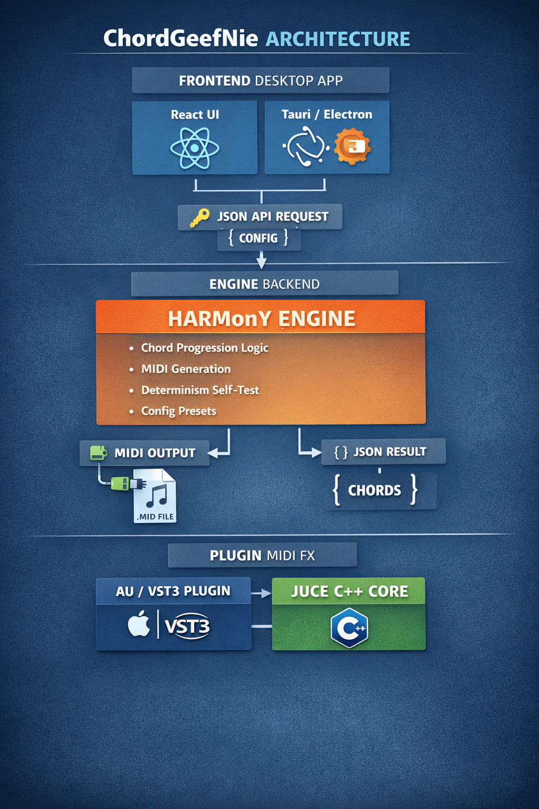

Top. Hieronder krijg je één samenhangende, aangescherpte README-variant met duidelijk gescheiden publieks- vs interne lagen, plus concrete scripts voor screenshots/demo-GIFs, én uitgebreide secties voor Web MVP en Plugin (JUCE/AU/VST3).

Je kunt dit letterlijk kopiëren naar README.md.
De structuur is zo opgezet dat:
    •	een recruiter / externe lezer na ~60 seconden begrijpt wat dit is en waarom het interessant is
    •	een technische lezer meteen ziet: dit is serieus, reproduceerbaar, en architecturaal doordacht

⸻


# 🎹 ChordGeefNie

**ChordGeefNie** is een **deterministische akkoordprogressie-engine** die **MIDI** genereert voor DAW’s.  
Het project is opgezet als een **spec-gedreven Proof of Concept** met een duidelijke route naar:

- een lokale desktop app (React + Tauri/Electron)
- een MIDI-FX plugin (AU / VST3 via JUCE)

Alles werkt **offline**, **OS-onafhankelijk** en **reproduceerbaar**.

> No cloud. No hype. Just chords → MIDI → music.

---

## 🧑‍💼 Voor wie is dit interessant?

### 🎯 Voor recruiters / hiring managers
Dit project laat zien:
- sterke **software-architectuur** (spec → tech → code)
- **deterministisch en testbaar** systeemontwerp
- begrip van **audio/MIDI-domein**
- ervaring met **CLI tooling, JSON contracts, packaging**
- vooruitdenken richting **desktop apps en plugins**

Dit is geen tutorial-project, maar een **engine-first product-prototype**.

### 🧠 Voor engineers / makers
- Geen black box AI
- Geen random output zonder controle
- Elke beslissing is:
  - verklaarbaar
  - reproduceerbaar
  - testbaar


---

## ✨ Wat doet ChordGeefNie?

- Genereert akkoordprogressies (major / minor)
- Volledig **deterministisch via seed**
- Exporteert **MIDI** met:
  - instelbare PPQ (ticks per beat)
  - tempo meta-event
  - simultaan of arpeggio playback
  - velocity modes (fixed / range / humanize)
  - instelbare MIDI channel
- Ondersteunt:
  - cadence varianten (soft / strong / plagal / half)
  - diatonische seventh chords (toggle)
  - voicing spread (close / open)
  - inversies (root / random / smooth)
- Presets opslaan & laden (JSON)
- CLI + library-bruikbaar
- Volledig **offline**

---

## ❌ Wat doet het expliciet niet?

- Geen audio synthese
- Geen genre-voorspelling
- Geen “AI schrijft een hit”
- Geen cloud / telemetry
- Geen non-diatonische harmonie (MVP)

---

## 📦 Projectstatus

- **Versie:** v0.2.0
- **Status:** Werkende MVP / Proof of Concept
- **Architectuur:** single-file engine (`chordgeefniet.py`)
- **Ontwikkelmodel:** AI-first, spec-gedreven

---

## 📁 Repository structuur

chordgeefnie/
├── chordgeefniet.py
├── README.md
├── CHANGELOG.md
├── LICENSE
└── docs/
├── FS-ChordGeefNie-v0.2-Extended-B.md
└── TS-ChordGeefNie-v0.2.md

---

## 🚀 Quick start

### Vereisten
- Python 3.10+
- Voor MIDI export:
```bash
  pip install mido
```

Basisgebruik
```bash
python chordgeefniet.py --key C --scale minor --bars 8
```


Deterministisch (reproduceerbaar)
```
python chordgeefniet.py --key C --scale minor --bars 8 --seed 123
```bash

JSON output (voor web / integratie)
```
python chordgeefniet.py --key C --scale minor --bars 8 --seed 123 --json
```bash

MIDI export
```
python chordgeefniet.py --key C --scale minor --bars 8 --seed 123 \
  --export-midi --midi-out output.mid
```bash


⸻

🧪 Determinisme & tests
```bash
pip install mido
python chordgeefniet.py --selftest
```

De tests controleren:
    •	identieke akkoordprogressies bij gelijke seed
    •	identieke MIDI events
    •	identieke .mid file hash (SHA-256)

Dit is een bewuste designkeuze:
muzikale output moet reproduceerbaar zijn.

⸻

🖼️ Screenshots & demo-GIFs (script)

Screenshot 1 – CLI output

Command:
'''bash
python chordgeefniet.py --key C --scale minor --bars 8 --seed 123
'''

Laat zien:
    •	versie-banner
    •	cadence / voicing instellingen
    •	gegenereerde progression

⸻

Screenshot 2 – JSON output

```bash
python chordgeefniet.py --key C --scale minor --bars 8 --seed 123 --json
```

Laat zien:
    •	JSON contract
    •	geschikt voor web/frontend gebruik

⸻

Demo-GIF – MIDI in DAW

Script:
    1.	Run MIDI export:

```bash
python chordgeefniet.py --key C --scale minor --bars 8 --seed 123 \
  --cadence plagal --sevenths --voicing open --inversion smooth \
  --export-midi --midi-out demo.mid
```

    2.	Import demo.mid in DAW (Logic / Ableton)
    3.	Zet eenvoudige piano-plugin
    4.	Play → hoor verschil tussen:
    •	simultaan
    •	arpeggio

⸻

🌐 Web MVP (React + Tauri/Electron)

Architectuur
    •	Frontend: React
    •	Runtime: Tauri (of Electron)
    •	Engine: lokale binary van ChordGeefNie

Contract

Frontend roept lokaal:

chordgeefniet --json --key C --scale minor --bars 8 --seed 123

Frontend verwacht:
    •	progression.chords[].symbol
    •	progression.chords[].notes

Packaging
    •	Dev: Python script
    •	Distributie: standalone binary (PyInstaller)
    •	Geen internet nodig

⸻

🎛️ Plugin roadmap (JUCE – AU / VST3)
    •	Type: MIDI-FX plugin
    •	Doel: realtime MIDI output (geen audio)
    •	Host: Logic (AU), Ableton/Reaper (VST3)

Parameters (1:1 met engine)
    •	Key / Scale
    •	Bars
    •	Seed
    •	Cadence style
    •	Seventh toggle
    •	Voicing spread
    •	Inversion mode
    •	Note length
    •	Playback mode
    •	Velocity model
    •	MIDI channel

Engine-strategie
    •	Python engine = reference implementation
    •	Plugin = C++ port van Harmony Engine
    •	Geen Python embedding in plugin (sandbox/signing issues)

⸻

🧠 Ontwikkelfilosofie

Dit project volgt een strikt spec-gedreven aanpak:
    1.	Functionele specificaties (FS)
    2.	Technische specificaties (TS)
    3.	Codegeneratie
    4.	Werkende demo

Geen code zonder goedgekeurde specs.
Geen onverklaarbare magie.

⸻

📜 Licentie

MIT License — vrij te gebruiken, ook commercieel.

⸻

⚠️ Disclaimer

ChordGeefNie is een hulpmiddel, geen vervanging van muzikale keuzes.
Gebruik het als startpunt, niet als eindpunt.

---

### Wat kan ik nu nog voor je doen?
Logische vervolgstappen:

1. **README inkorten tot “LinkedIn-proof” versie**
2. **Eén pagina `ARCHITECTURE.md` maken**
3. **Web MVP repo-structuur genereren**
4. **JUCE plugin skeleton uitschrijven**

Zeg maar — je zit nu in de fase waarin dit *echt* indruk maakt.